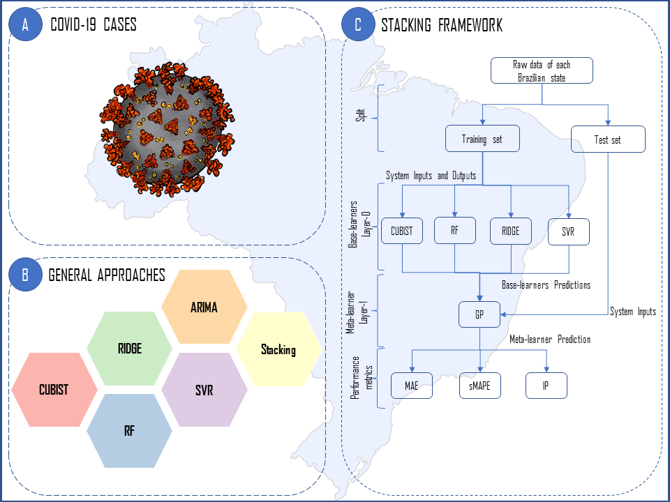

# Publication in Chaos, Solitons & Fractals Elsevier Journal
## :mask: Short-term forecasting COVID-19 cumulative confirmed cases: Perspectives for Brazil



### Publication
- [Preprint (ResearchGate)](https://www.researchgate.net/publication/341025731_Short-term_forecasting_COVID-19_cumulative_confirmed_cases_Perspectives_for_Brazil)
- [Journal paper (ScienceDirect)](https://www.sciencedirect.com/science/article/pii/S0960077920302538)

### How to cite this paper
````bibtex
@article{ribeiro2020short,
title={Short-term forecasting {COVID-19} cumulative confirmed cases: Perspectives for {Brazil}},
author={Ribeiro, Matheus Henrique Dal Molin and da Silva, Ramon Gomes and Mariani, Viviana Cocco and Coelho, Leandro Santos},
journal={Chaos, Solitons \& Fractals},
volume={135},
pages={109853},
year={2020},
publisher={Elsevier},
doi={10.1016/j.chaos.2020.109853}
}
````
